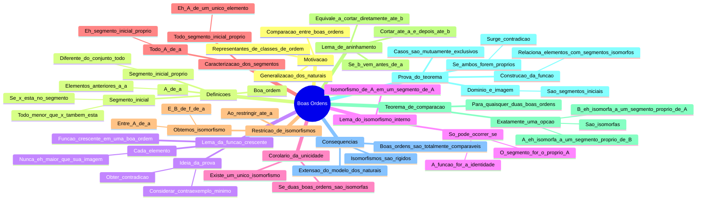

[[Boa Ordenação]]
Queremos generalização dos números naturais e de representantes de classes de Boa Ordem.

## Definição de Segmento Inicial
**Def.**: Sejam $(A,\lt)$ uma boa ordem. $S \subseteq A$ é  um segmento inicial de $A$. Se para todo $x \in S$ e para todo $y\in A$, $y< x$ então $y\in S$. Dizemos que é um segmento inicial $S$ de $A$ é próprio se $S \not=A$.
$$
\forall x\in S\forall y\in A (y<x \rightarrow y\in S)
$$

## Para todo $\phi$ crescente, $a \leq \phi(a)$
**Lema**: Seja $A$ uma boa ordem e $\phi: A\to A$ crescente. Então, $\forall a\in A(a\leq \phi(a))$.
*Prova*: Assuma que exista $a\in A$ tal que $\phi(a) \lt a$, isto é, suponha que S = $\{x\in A : \phi(x) \lt x\}$ é não vazio. Então, como $A$ é boa ordem, $S$ tem mínimo e seja $a = \min S$. Analisemos:
$$
\phi(a) \lt a \implies \phi(\phi(a)) \lt \phi(a)
$$
Usando o fato de que $\phi$ é crescente. Mas temos que $\phi(a) \in S$, mas $\phi(a) < a$, contradizendo que $a = \min S$, absurdo.

## Só existe um isomorfismo entre A e um Seg. Inicial de A se o seguimento for o próprio A. Se duas boas ordens são isomorfas, existe único isomorfismo
**Lema**: Seja $S$ um segmento inicial de uma boa ordem $A$ e $f: A\to S$ um isomorfismo. Então, $A = S$ e $f = id_A$.
*Prova*: Sejam $a<b \in A$, sabemos que, por $f$ ser isomorfismo, $f(a) < f(b)$, logo, $f$ é crescente. Pelo lema anterior $\forall a\in A( a\leq f(a))$, assim, $a \in S$, pela definição de segmento inicial e, portanto, $A = S$.
Como $f^{-1}$ é crescente, sabemos que $a \leq f^{-1}(a) \implies f(a) \leq a$ . Concluímos que $f(a) = a$ para todo $a\in A$.

**Corolário**: $A,B$ boas ordens. Se $A \cong B$, então existe único isomorfismo.
*Prova*: Suponha que $f,g: A \to B$ são isomorfismos. Temos que $g^{-1}\circ f: A\to A$ é isomorfismo de $A$ em um segmento inicial de $A$, logo $g^{-1}\circ f = id_A \implies g = f$.

## Caracterização de Seg. Inicial para boas ordens
**Def.**: Seja $A$ uma boa ordem e $a \in A$. Definimos $A[a] = \{x\in A : x\lt a\}$

**Lema**: Sejam $A$ uma boa ordem e $a \in A$. Então $A[a]$ é um segmento inicial prórprio de $A$. Reciprocamente, se $S$ é segmento inicial próprio de $A$, então existe único $a \in A$ tal que $S = A[a]$. 
*Prova*: Provemos que $A[a]$ é segmento inicial, isto é:
$$
\forall x\in A[a] \forall y\in A(y<x \rightarrow y\in A)
$$
Tomemos $x\in A[a]$, sabemos que $x < a$. Assim, $y < x \implies y < a \implies y\in A[a]$, como queríamos. Notemos que $a\in A$ não está em $A[a]$, logo $A[a]$ é segmento inicial próprio.
Seja $S$ um segmento inicial próprio de $A$, tomemos $a =\min(A\setminus S)$. Se $x \in S$ e $x \not\in A[a]$, então $a < x$ (não pode ser igual pois estamos considerando $A\setminus S$ e $x\in S$), que, por definição, implica que $a \in S$, absurdo. Assim, $S \subseteq A[a]$. 
Note que $A\setminus S = \{x\in A : x\not\in S\}$, assim, segue pela minimalidade de $a$ que $A[a] \subseteq S$. A unicidade se

## Restrição para Seg. Inicial continua sendo isomorfismo
**Lema**: $A, B$ boas ordens e $f:A \to B$ isomorfismo. Então, para todo $a \in A$ $f\upharpoonright_{A[a]} :A[a] \to B[f(a)]$ é um isomorfismo.
*Prova*: Seja $x \in A[a]$, sabemos que $x < a$ e, por f ser isomorfismo, $f(x)  < f(a)$, logo, Img$(A[a]) \subseteq B[f(a)]$.
É injetor pois $f$ é injetora e, para todo $y\in B[f(a)]$, sabemos que existe $x \in A$ tal que $f(x) = y$, como é isomorfismo, $f(x) < f(a) \implies x<a$, logo, $x\in A[a]$, logo é sobrejetora.

## Possibilidades de Isomorfismo entre boas ordens
**Lema**: Seja $A$ uma boa ordem e $b< a \in A$. $(A[a])[b] = A[b]$.
*Prova*: Usaremos que $\forall x\in A(x\lt b\rightarrow x\in A[a])$, isto é $A[b] \subseteq A[a]$. Assim, como $A[a] \subseteq A$, então $(A[a])[b] \subseteq A[b]$. Por outro lado, $x\in A[b] \implies x\in A \land x\lt b$, como $x < b$, podemos restringir para $x\in A[a] \land x < b \implies x\in (A[a])[b]$.

**Teorema**: Sejam $A$ e $B$ ordens. Então, somente uma é verdadeira:
- a) $A$ é isomorfo a $B$
- b) $A$ é isomorfo a um segmento inicial próprio de $B$
- c) $B$ é isomorfo a um segmento inicial próprio de $A$
Em todos os casos, o isomorfismo é único.
*Prova*: O isomorfismo único segue do corolário. Provemos que são, dois a dois, impossíveis de serem verdade juntos.
- a) e b): Seja $f:A\to B$ um isomorfismo e $g: A \to B[b]$ outro isomorfismo. Então, $g\circ f^{-1}: B \to B[b]$ é um isomorfismo. Absurdo pelo lema.
- a) e c): Análogo ao anterior.
- b) e c) Seja $f:B\to A[a]$ isomorfismo. Então, $f\upharpoonright_{B[b]}: B[b] \to (A[a])(f(b))$ é isomorfismo. Consideramos, agora, $g: A \to B[b]$ o isomorfismo até o segmento incial. Temos: 
$$
g\circ (f\upharpoonright_{B[b]})^{-1}: (A[a])[f(b)]
 \to A$$
é um isomorfismo. Então, Logo, temos que $A$ é isomorfo a um segmento próprio de $A$, absurdo.
Vejamos, agora, que vale algum. Considere $f = \{(a,b) \in A\times B : A[a] \cong B[b]\}$. Dom$f$ é segmento incial de  $A$. De fato, se $a\in$ dom$f$, então todas as restrições para $x < a$ são isomorfismos. Analogamente para ran$f$, só precisando usar a inversa. 
Além disso, $f$ é função: Se $(a,b), (a',b) \in f$, então temos que $B[b] \cong B[b']$, um tem que ser segmento inicial do outro, usando o lema, sabemos que os dois são iguais e, pela unicidade, segue que $b = b'$.
Além do mais, $f$ é crescente. Sejam $a<a'\in$ dom$f$. Então tome a restrição do isomorfismo $g$ de $A[a'] \to B[g(a')]$, isto é, um isomorfismo (que sabemos que é único) $(A[a'])[a] = A[a] \to B[g(a)]$. Como $f$ é função, temos que $(a', g(a')) \in f \implies g(a) = f(a)$, logo, $g(a) = f(a) < f(a')$, logo é crescente. (chato).
Agora, note que, se dom$f$ = A ou ran$f$ = B, uma das alternativas é verdadeira. Agora, provemos que a negativa disso nunca ocorre, isto é, nunca é o caso de que dom$f$ $\neq A$ e ran$f$ $\neq B$. Teríamos dom$f$ e ran$f$ sendo segmentos inciais próprios. Sejam, dom$f$ = $A[a]$ e ran$f$ = $B[b]$, assim, $f:A[a] \to B[b]$ é um isomorfismo, logo, $(a,b) \in f \implies a\in$ dom$f = A[a]$, absurdo.