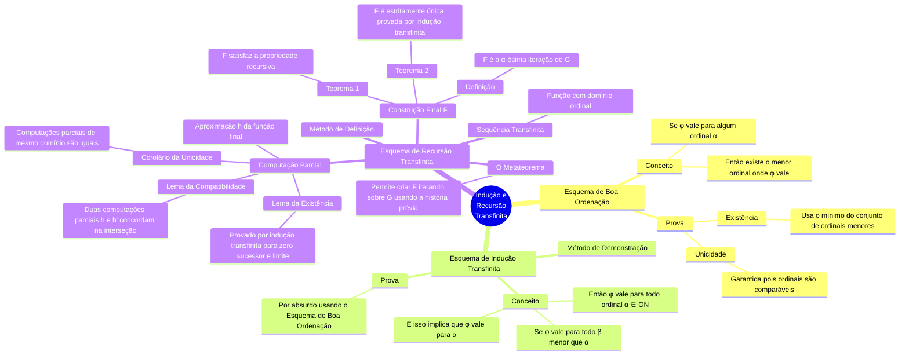

Altamente análogo à indução e recursão vista nos naturais, dessa vez, para os [[Números Ordinais]].
*Obs.*: Consideraremos $G(p,s)$ um símbolo de função binário introduzido por definição.

## Esquema de Boa Ordenação
**Prop. (Esquema da Boa Ordenação)**: Seja $\phi(\alpha,t_1,\dots,t_n)$ uma fórmula. Suponha que para alguns $t_1,\dots,t_n$ fxados exista um ordinal $\alpha$ tal que $\phi(\alpha,t_1,\dots,t_n)$.  Então existe o menor ordinal tal que $\phi(\alpha,t_1,\dots,t_n)$. 
Em símbolos:
$$
\forall t_1\dots\forall t_n (\exists \alpha\in ON (\phi(\alpha,t_1,\dots,t_n) \to \exists! \alpha\in ON(\phi(\alpha,t_1,\dots,t_n)\land\forall \beta < \alpha(\beta\neg\phi(\dots)))))
$$
*Prova*: Seja $\gamma$ um ordinal tal que $\phi(\gamma,t_1,\dots,t_n)$. Se valer $\forall \beta < \gamma (\beta\neg\phi(\beta,t_1,\dots,t_n))$, então a existência está provada para este caso. Senão, considere $X = \{\alpha < \gamma : \phi(\alpha,t_1,\dots,t_n)\}$, como $X$ é não vazio e é um conjunto de ordinais, é bem ordenado e, portanto, possui mínimo. Seja $\alpha$ esse mínimo, teríamos que se $\beta < \alpha$, então, $\beta< \gamma$ e, pela minimalidade, não vale $\phi(\beta,t_1,\dots,t_n)$.
Considere agora, que $\alpha'$ também satisfaz, $\phi(\alpha',t_1,\dots,t_n)$ e $\forall \beta < \alpha(\neg\phi(\beta,t_1,\dots,t_n))$. Como $\alpha'$ é um ordinal, é comparável com $\alpha$. Se $\alpha'< \alpha$, contradiz a minimalidade, analogamente para o contrário. Então, $\alpha = \alpha'$.

## Esquema de Indução Transfinita
**Prop. (Esquema de Indução Transfinita)**: Seja $\phi(\alpha,t_1,\dots,t_n)$ uma fórmula. Suponha que para alguns $t_1,\dots,t_n$ fixados e para todo ordinal $\alpha$, se $\forall\beta<\alpha(\phi(\beta,t_1,\dots,t_n))$, então $\phi(\alpha,t_1,\dots,t_n)$.
Em símbolos:
$$
\forall t_1\dots\forall t_n((\forall \alpha\in ON (\forall\beta<\alpha(\phi(\beta,t_1,\dots,t_n)) \to\phi(\alpha,t_1,\dots,t_n))\to\phi(\alpha,t_1,\dots,t_n) \to \forall\alpha\in ON (\phi(\alpha,t_1,\dots,t_n))
$$
*Prova*: Fixe $t_1,\dots,t_n$ e suponha que exista um ordinal $\alpha$ tal que não vale $\phi(\alpha,t_1,\dots,t_n)$ . Pela proposição anterior, temos um $\alpha$ menor ordinal que isso acontece. Temos que $\forall \beta < \alpha (\phi(\beta,t_1,\dots,t_n))$, então vale para $\alpha$, absurdo.

## Esquema de Recursão Transfinita
**Def.**: Uma sequência transfinita é uma função cujo domínio é um ordinal. Se $s$ é uma sequência transfinita, dizemos que $x \in V^{<ON}$.

Notemos que indução transfinita é um modo de demonstração e, recursão transfinita é um método de definição.

**Metateorema (Esquema de Recursão Transfinita)**: Suponha $G(p,s)$ introduzido de modo que 
$$
\forall s\in V^{<ON}\forall p\forall y(G(p,s) = y \leftrightarrow\phi(s,y,p))
$$
Então, é possível introduzir um símbolo de função binário $F(p,\alpha)$ de modo que $\forall \alpha\in ON\forall p(F_{p}(\alpha) = G(p, F_P|\alpha))$. Ademais, é único, no sentido de que, se $H$ é um símbolo de função binário que vale analogamente ao anterior, então os dois são iguais.

*Remark*: Chamamos de metateorema, pois não afirma coisas sobre conjuntos e sim que, a partir de um símbolo $G$ introduzido por definição, podemos adicionar outro símbolo $F$ por definição que satisfaça certas coisas.

Provemos o metateorema. Para isso:

**Def.**: Seja $G(p,s)$ definido de modo que
$$
\forall s\in V^{<ON}\forall p\forall y(G(p,s) = y \leftrightarrow\phi(s,y,p))
$$
Para todo $\alpha$ ordinal e todo $p$, uma computação parcial de parâmetro $\alpha$ e baseada em $G$ é uma função $h$ tal que dom $h$ = $\alpha$ e $\forall \beta< \alpha(h(\beta) = G(p,h|\beta))$.
Em símbolos, 
$$
\forall h\forall \alpha\forall p(A_{P_G}(h,\alpha,p) \leftrightarrow h \text{ é função}\land \alpha \in ON\land dom h = \alpha\land \forall \beta< \alpha(h(\beta) = G(p,h|\beta))) 
$$
**Lema**: Considere $G(p,s)$. Para todos $p, \alpha, \alpha', h, h'$. Se $A_{P_G}(h,\alpha,p)$ e $A_{P_G}(h',\alpha',p)$, então $h$ e $h$' são compatíveis. 
*Dem.*: Fixamos tais $p, \alpha, \alpha', h, h'$. Suponha que não sejam compatíveis, então existe $\beta \in \alpha\cap\alpha'$ tal que $h(\beta) \neq h'(\beta)$, suponha $\beta$ o menor ordinal no qual isso ocorre. 
Como $\beta \subseteq \alpha\cap \alpha'$ e $h|\beta = h'|\beta$, obtemos:
$$
h(\beta) = G(p, h|\beta) = G(p, h|\beta') = h'(\beta) 
$$
Contradição.

**Corolário**: Considere $G(p,s)$. Para todos $h,h',\alpha,p$ se $A_{P_G}(h,\alpha,p)$ e $A_{P_G}(h',\alpha,p)$, então $h = h'$.
*Dem*: Se $A_{P_G}(h,\alpha,p)$ e $A_{P_G}(h',\alpha,p)$, então $domh = domh'$, que são compatíveis.

**Lema**: Seja $G(p,s)$ um símbolo de finção introduzido por definição. Para todo $p$ e todo $\alpha$ ordinal, existe uma computação parcial de comprimento $\alpha$ e parâmetro $p$ baseado em $G$.
*Dem*: Fixe $p$. Indução transifinita em $\alpha$. Suponha que, $\forall \beta < \alpha \exists A_{P_G}(h,\alpha,p)$. Então, para $\alpha$:
- Se $\alpha = 0$, então $A_{P_G}(h,\alpha,p)$ para $h = \emptyset$;
- Se $\beta = \alpha + 1$, pela hipótese de indução, existe uma computação parcial de parâmetro $p$ baseada em $G$. Seja $A_{P_G}(h,\alpha,p)$, definamos $h'= h\cup\{(\beta, G(p,h))\}$.
- Se $\alpha$ é ordinal limite. Pela hipótese de indução e pelo corolário anterior, existe única $h_{\beta}$ para cada $\beta < \alpha$. Considere, então, usando o axioma da substituição, $H = \{h_{\beta} : \beta < \alpha\}$, é um conjunto de funções compatíveis e, portanto, $\bigcup H$ é função. Assim, se $\beta< \alpha$, então $\beta + 1 \leq \alpha$, por $\alpha$ ser limite, $\beta + 1 < \alpha$ então, $h(\beta) =  h_{\beta + 1}(\beta)$.

**Def.**: $G(p,s)$. A $\alpha$-ésima iteração de $G$ com parâmetro $p$, denotada por $F^G(p,\alpha)$ é $h(\alpha)$, em que $h$ é alguma computação parcial de comprimento $\beta > \alpha$ e parâmetro $p$ baseada em $G$.
Em símbolos:
$$
\forall p \forall \alpha\in ON\forall y(F^G(p, \alpha) = y \leftrightarrow \exists h\exists\beta(A_{P_G}(h,\beta,p)\land\alpha<\beta\land h(\alpha) = y))
$$
Pelos lemas anteriores, está bem definido pois $F^G(p,\alpha)$ existe e é único. Podemos omitir o $G$ quando estiver claro pelo contexto.

**Teorema**: $G(p,s)$. Denote por $F_p(\alpha) = F(p,\alpha)$ a $\alpha$-ésima iteração de $G$. Então:
$$
\forall p\forall \alpha\in ON(F_p(\alpha)=G(p,F_p|\alpha))
$$
*Dem.*: Considere $A_{P_G}(h, \alpha, p)$ tal que $h(\alpha) = F_p(\alpha)$. Pela definição de $F$, temos que $h(\xi) = F_p(\xi) \forall\,\xi < \alpha$. Assim, $h|\alpha = F_p|\alpha$, logo
$$
F_p(\alpha) = h(\alpha) = G(p, h|\alpha) = G(p,F_p|\alpha)
$$
Basta, agora, mostrar que é única.

**Teorema**: Sejam $G(p,s)$ e $F'(p,s)$ dois símbolos de funções binários introduzidos por definição e $F$ a $\alpha$-ésima iteração de $G$. Seja $p$ tal que $\forall \alpha \in ON (F'_p(\alpha) = G(p, F'_P|\alpha)$.
Então, $\forall \alpha\in ON(F_p(\alpha) = F'_p(\alpha))$.
*Dem.*: Indução transfinita em $\alpha$. Se vale para todo $\beta < \alpha$, então $F'_p|\alpha = F_p|\alpha$. Assim, $F'_P(\alpha) = G(p, F'_P|\alpha) = G(p, F_p|\alpha) = F_p(\alpha)$.
