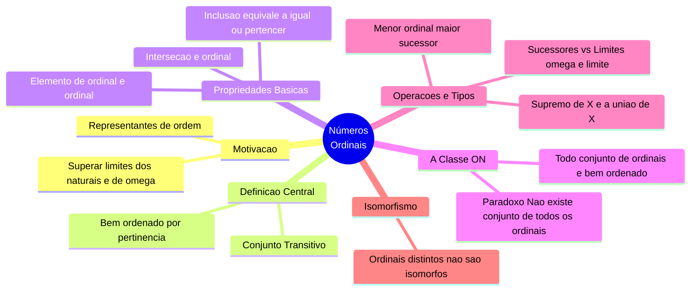

Usaremos todas as notações, definições e resultados de [[Boas Ordens]].

## Motivação
Vimos que todo natural tem boa ordem com base na relação de pertencimento $\in$. Vimos, também, que $\omega$ é bem ordenado.
Para além disso, vimos que todo conjunto bem ordenado é isomorfo a algum $n\in \omega$. Assim, os naturais servem para representantes de ordens finitas.
Queremos, porém, achar representantes para todos os conjuntos bem ordenados, A tentativa seria continuar o processo, isto é:
$$
1,2,\dots,\omega,S(\omega),S(S(\omega))\dots
$$
O que, de fato produz boas ordenações por $\omega$. Assim, temos a ideia de definir um ordinal como um conjunto bem ordenado por $\in$. A unicidade, porém, não é garantida, pois podemos gerar um conjunto que segue a seguinte regra:
$$
\exists b\in B \exists a\in b(a\not \in B)
$$
Construiremos nossa noção de ordinal exigindo que isso não aconteça, isto é, que 
$$
\forall b\in B\forall a \in b (a \in B)
$$
Chamaremos de:

## Definição de Ordinais
**Def.**: Um conjunto $A$ é dito transitivo se $\forall a\in A(a\subseteq A)$.

Assim, podemos definir:

**Def.**: Um ordinal é um conjunto $A$ tal que:
- A é bem ordenado por perntencimento $\in$; e
- A é transitivo.

Provemos algumas coisas sobre eles.

## Todo elemento de um ordinal é ordinal
**Lema**: Seja $\alpha$ um ordinal, então, todo elemento de $\alpha$ é um ordinal.
*Prova*: Seja $\beta \in \alpha$, então $\beta \subseteq \alpha$, logo, $\beta$ é bem ordenado por $\in$ (apenas restingimos). Resta saber se é transitivo. Seja $\gamma \in \beta$, queremos mostrar que $\gamma \subseteq \beta$, para isso, vamos considerar $\delta \in \gamma$, sabemos que ambos pertencem a $\alpha$ e, em particular, $\delta \in \alpha$. Assim, temos que $\delta < \gamma < \beta$ em $\alpha$, logo, $\delta < \beta$, assim, $\gamma \subseteq \beta$.

Agora, queremos provar que $\in$ é uma boa ordem nos ordinais. Provemos os seguintes lemas:

## Interseção de ordinais é ordinal
**Lema**: Seja $A$ um conjunto não vazio de ordinais, então $\bigcap X$ é um ordinal.
*Prova*: Seja $\alpha \in A$, sabemos que, pela definição de interseção, $\bigcap X \subseteq \alpha$, então $\bigcap X$ é bem ordenado por $\in$. 
Resta provar que é transitivo. Tomemos $\beta \in \bigcap A$, assim para todo $\xi \in A$ tal que $\beta \in \xi \implies \beta \subseteq \xi$, por $\xi$ ser ordinal. Como vale para todo $\xi\in A$, $\beta \subseteq \bigcap A$.

Sabemos, pela boa ordenação, que, dados dois ordinais, $\alpha \lt \beta \Longleftrightarrow \alpha\in \beta$. Achemos uma caracterização para $\leq$:

## Equivalência de subseteq para ordinais
**Lema**: Sejam $\alpha$ e $\beta$ ordinais, então $\alpha \subseteq \beta \Longleftrightarrow \alpha = \beta \lor \alpha \in \beta$.
*Prova*: A volta segue diretamente da definição.
Suponha que $\alpha \subsetneq \beta$. Consideremos $X = \beta \setminus \alpha$ e $\delta = \min X$. Note que, se provarmos que $\delta = \alpha$, então nossa demonstração está concluída, uma vez que $\delta = \alpha \in \beta$. Seja $\xi \lt \delta$, sabemos que $\xi \not\in X$, mas, como $\xi \in \beta$, então $\xi \in \alpha$, logo, concluímos que $\delta \subseteq \alpha$. 
Suponha, agora, que exista $\gamma \in \alpha\setminus \delta$. Então $\gamma, \delta \in \beta$, pois $\beta$ é transitivo. Como pertencem a um ordinal, são comparáveis.
Consideremos:
- $\gamma \in \delta$: Absurdo, pois $\gamma\in \alpha \setminus \delta$;
- $\gamma = \delta$: Absurdo, pois $\gamma \in \alpha$ e $\delta \not\in \alpha$, pois $\delta\in\beta\setminus\alpha$;
- $\delta \in \gamma$: Absurdo, pois teríamos $\delta \in \gamma \in \alpha \implies \delta\in\alpha$.
Assim, $\alpha\setminus \gamma = \emptyset$, logo, $\alpha \subseteq \gamma$, concluímos que são iguais.

## Todo conjunto de ordinais é bem ordenado e não existe o conjunto de todos os ordinais
**Prop**: Sejam $\alpha, \beta$ e $\gamma$ ordinais:
- a) $\alpha \not\in \alpha$;
- b) Se $\alpha \in \beta$ e $\beta \in \gamma$, então $\alpha \in \gamma$;
- c) $\alpha \in \beta$ ou $\alpha = \beta$ ou $\beta \in \alpha$;
- d) Todo conjunto de ordinais $X$ não vazio tem um mínimo e $\bigcap X = \min X$.
*Prova*: a) Suponha que $\alpha \in \alpha$, então, sabemos que $\exists x\in \alpha(x \in x)$, mas sabemos que $\in$ é boa ordenação estrita em $\alpha$, logo, é antireflexiva.
b) Como $\gamma$ é transitivo, então $\beta \subseteq \gamma$, logo, $\alpha \in \gamma$.
c) Tome $\gamma = \alpha \cap \beta$, sabemos que é um ordinal e que $\gamma \subseteq \alpha$ e que $\gamma \subseteq \beta$, dividamos em casos:
- Se $\gamma = \alpha$, então, $\alpha \subseteq \beta \implies \alpha\in\beta\lor\alpha=\beta$
- Se $\gamma = \beta$, análogo ao anterior e teremos $\alpha = \beta$ ou $\beta \in \alpha$
- Se $\gamma \subsetneq \alpha$ e $\gamma \subsetneq \beta$, então $\gamma\in\alpha$ e $\gamma\in\beta$, logo, $\gamma\in \alpha\cap\beta = \gamma$, absurdo pelo item a).
d) Seja $X$ um conjunto não vazio de ordinais. Tomemos $\alpha = \bigcap X$. Sabemos que, para todo $\beta \in X$, $\alpha \subseteq \beta$, pelo lema anterior, $\alpha \leq \beta$ para todo $\beta\in X$. Resta mostrar que $\alpha \in X$. Assuma que $\alpha \not\in X$ (como $\alpha \subseteq \beta \Longleftrightarrow \alpha = \beta \lor \alpha\in\beta$), sabemos que $\alpha\in\beta$ para todo $\beta\in X$, logo, $\alpha \in \bigcap X = \alpha$, absurdo, por a).

**Corolário**: Todo conjunto de ordinais é bem ordenado por $\in$. Assim, todo conjunto de ordinais transitivo é um ordinal.
*Prova*: Por a) é irreflexivo, por b) é transitivo, por c) é total e por d) todo conjunto não vazio tem mínimo.

**Corolário**: Não existe conjunto de todos os ordinais. Isto é, não existe $X$ tal que $\forall \alpha(\alpha \text{ é ordinal} \rightarrow \alpha \in X)$.
*Prova*: Suponha que exista, então esse conjunto é transitivo e bem ordenado por $\in$, logo, é ordinal. Mas não pode se pertencer por a), absurdo.

## Menor ordinal maior
**Prop.**: Seja $\alpha$ um ordinal, então $S(\alpha)$ é um ordinal e é o menor ordinal tal que $\alpha < \beta$. 
*Prova*: $S(\alpha)$ é um conjunto de ordinais. Vejamos se é transitivo. Se $\gamma \in S(\alpha) = \alpha \cup \{\alpha\}$, se $\gamma \in \alpha$, então, por $\alpha$ ser ordinal, $\gamma \subseteq \alpha \subseteq S(\alpha)$, se $\gamma = \alpha$, então $\gamma \subseteq S(\alpha)$. Logo, $S(\alpha)$ é ordinal.
$\alpha \in S(\alpha)$, logo, $\alpha < S(\alpha)$. Se $\gamma < S(\alpha)$, então $\gamma \leq \alpha$, logo, $\gamma \leq \alpha$, logo, não existe $\gamma$ tal que $\alpha < \gamma < S(\alpha)$. 

A classe dos ordinais é detonada por ON. Formalmente, ela não é um conjunto, é um símbolo de predicado e escrevemos "$\alpha\in$ ON" quando queremos dizer ON$(\alpha)$, que significa $\alpha$ é um ordinal.

## Supremo de um conjunto de ordinais
**Lema**: Seja $X$ um conjunto de ordinais. Então, $\bigcup X$ é um ordinal. Além disso, $\bigcup X$ é o supremo de $X$ em ON, i.e., o menor ordinal $\beta$ tal que $\alpha \leq \beta$ para todo $\alpha \in X$.
*Prova*: Como $X$ é formado por ordinais, então $\forall \alpha \forall\beta(\alpha\in\beta\in X)$ são ordinais e, portanto, $\bigcup X$ é um conjunto de ordinais. Provemos que é transitivo. Se $\alpha \in \bigcup X$, então $\alpha \in \beta$ para algum $\beta\in X$, como $\forall x\in\beta(x\in \bigcup X)$, $\beta \subseteq X$ e, por $\alpha\in\beta$ ser ordinal, $\alpha \subseteq \beta \subseteq \bigcup X$.
Concluímos que $\bigcup X$ é ordinal. Seja $\alpha\in X$, temos que $\alpha \subseteq \bigcup X \implies \alpha \leq \bigcup X$ (pelo lema). Se $\alpha < \bigcup X$, então existe um $\beta \in X$ tal que $\alpha \in \beta \implies \alpha \subseteq \beta \subseteq X$, assim, $\alpha$ não é cota superior de $X$. Logo, $\bigcup X$ é o menor ordinal $\alpha$ tal que $\alpha \leq \beta$ para todo $\alpha \in X$.

Notação: Podemos escrever $\bigcup X = \sup X$.

## Ordinal sucessor e ordinal limite
**Def.**: Um ordinal $\beta$ é dito sucessor se é da forma $\beta = S(\alpha)$ para um $\alpha$ ordinal. Um ordinal limite é um ordinal não zero tal que não é sucessor de nenhum outro ordinal.

**Prop.**: $\omega$ é ordinal limite.
*Prova*: Suponha que exista um $\alpha$ ordinal tal que $S(\alpha) = \omega$, então, temos que $\alpha\cup\{\alpha\} = \omega$, logo, $\alpha\in\omega$. Porém, para todo $\alpha \in \omega$, sabemos que $S(\alpha)\in\omega$, obtemos que $\omega \in \omega$, absurdo.

## Dois ordinais distintos não podem ser isomorfos
**Prop.**: (Dois ordinais distintos não podem ser isomorfos). Sejam $\alpha$ e $\beta$ ordinais. Se $\alpha \cong \beta$, então $\alpha = \beta$.
*Prova*: Faremos pela contrapositiva. Suponha que $\alpha \neq \beta$, sem perda de generalidade, suponha que $\alpha < \beta$. Temos que $\alpha$ é um segmento inicial próprio de $\beta$, pois $\alpha \subsetneq \beta$ e se $\xi<\delta$ para algum $\delta \in \alpha$, então $\xi\in\alpha$. Pelo lema em [[Boas Ordens]], $\alpha$ não é isomorfo a $\beta$.